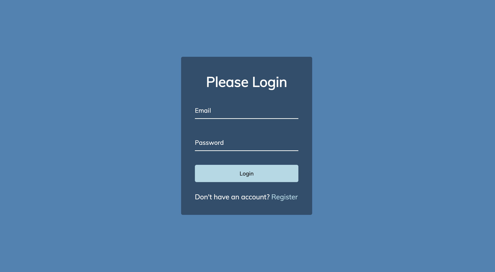

# 50 Projects in 50 Days - Form Wave

This is a code along project in the [50 Projects In 50 Days - HTML, CSS & JavaScript Udemy Course](https://www.udemy.com/course/50-projects-50-days/). Sharpen your skills by building 50 quick, unique & fun mini projects.

## Table of contents 😌

- [Overview](#overview)
  - [The project](#the-project)
  - [Screenshot](#screenshot)
  - [Links](#links)
- [My process](#my-process)
  - [Built with](#built-with)
  - [What I learned](#what-i-learned)
  - [Continued development](#continued-development)
  - [Code snippets](#im-really-proud-of-these-code-snippets%EF%B8%8F)
  - [Useful resources](#useful-resources)
- [Author](#author)
- [Acknowledgments](#acknowledgments)

## Overview👋🏾

Welcome to the 8th mini-project of the course!

### The project😥

In this project users will be able to:

- Build a form that displays wave animation.

### Screenshot🌇



### Links👩🏾‍💻

- Solution URL: (https://github.com/MaianneThornton/50in50_FormWave)
- Live Site URL: (https://peppy-marzipan-abb0fc.netlify.app/)

## My process💭

This is a simple project that I started by creating the form's HTML and marking out initial classes to be later used for styling. Next I began styling the css by styling the form and button. I then added the wave functionality by way of JavaScript targeting each character in the labels and adding transitions.

### Built with👷🏾‍♀️

- Semantic HTML5 markup
- CSS custom properties
- Flexbox
- JavaScript

### What I learned👩🏾‍🏫

I learned the logic behind making a wave transition by way of utilizing the cubic-bezier timing function. I will be applying this to future projects where needed. See below for [links](#links) that offer more details.

### Continued development🔮

In the future I plan on continuing to practice positioning elements using flexbox, and using different selectors to select elements.

I also plan on continuing to practice using HTMLElement properties to select properties to manipulate in JavaScript.

I also plan on continuing to learn the best ways to phrase git commits, so that future viewers can fully understand the changes that have occurred.

### I'm really proud of these code snippets✂️

```css
.form-control label span {
  display: inline-block;
  font-size: 18px;
  min-width: 5px;
  /* cubic-bezier defines a curve, takes in 4 points (p0 p1 p2 & p3), p0 & p3 are the start and the end of the curve respectively */
  transition: 0.3s cubic-bezier(0.68, -0.55, 0.265, 1.55);
}

.form-control input:focus + label span,
.form-control input:valid + label span {
  color: lightblue;
  /* moves up on the y-axis (negative is up, positive is down) */
  transform: translateY(-30px);
}
```

```js
labels.forEach(label => {
  // targets the characters of labels individually & sets that to the innerHTML
  label.innerHTML = label.innerText
    // splits the innerText (each letter) into an array
    .split('')
    // creates a new array & adds the wave transition delay to each letter via the index
    .map((letter, index) => `<span style="transition-delay:${index * 50}ms">${letter}</span>`)
    // turns the array back into a string
    .join('')
})
```

### Useful resources📖

- [Resource 1](https://developer.mozilla.org/en-US/docs/Glossary/Bezier_curve) - This article simply defines what a Bezier Curve is. I would recommend this to anyone researching curves and vectors in computer graphics or animation.
- [Resource 2](https://developer.mozilla.org/en-US/docs/Web/CSS/easing-function#the_cubic-bezier()_class_of_timing_functions) - This is a resource that explains the cubic-bezier timing function. This was very useful in understanding this concept as it was new to me
- [Resource 3](https://developer.mozilla.org/en-US/docs/Web/API/HTMLElement) - This is an amazing resource which lists and describes each HTMLElement.
- [Resource 4](https://www.freecodecamp.org/news/how-to-write-better-git-commit-messages/) - This is an amazing article which helped me write better commit messages. I'd recommend it to anyone still learning this concept.

## Author🔎

- Website - [Portfolio Site](https://www.maiannethornton.com/Portfolio/index.html)
- Frontend Mentor - [@MaianneThornton](https://www.frontendmentor.io/profile/MaianneThornton)
- GitHub - [@MaianneThornton](GitHub.com/MaianneThornton)
- Twitter - [@MaianneThornton](https://twitter.com/MaianneThornton)
- LinkedIn - [@MaianneThornton](https://www.linkedin.com/in/maiannethornton/)

## Acknowledgments🙏🏾

Special Thanks go to [Brad Traversy](http://www.traversymedia.com/) and [Florin Pop](http://www.florin-pop.com/) creating the course and making reviewing concepts fun 😊.
